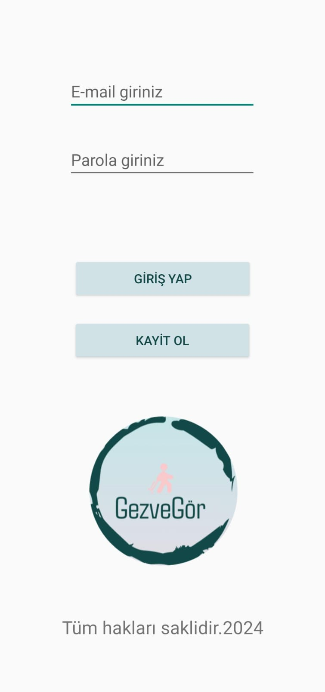
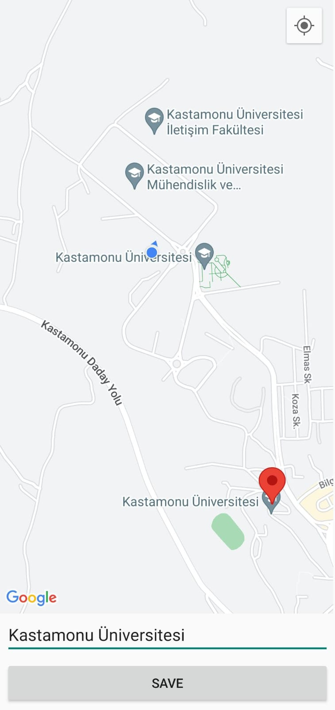

# Gez ve Gör - Gezilecek Yerler Uygulaması

**Gez ve Gör** uygulaması, kullanıcıların gezip görmek istedikleri yerleri keşfetmelerini ve bu yerler hakkında bilgi edinmelerini sağlayan bir mobil uygulamadır. Uygulama, gezilecek yerlerin harita üzerinde konumlarını gösterir, kullanıcılar için önerilerde bulunur ve gezilen yerlerin kaydedilmesini sağlar. Ayrıca, kullanıcılar favori yerlerini ekleyebilir ve gezdikleri yerleri işaretleyebilirler. Uygulama, kullanıcıya en yakın gezilecek yerleri bildirim olarak gönderir.

## Özellikler

- **Kişisel Profil ve Bilgiler**  
  Kullanıcılar uygulamaya giriş yaparak kendi profillerini oluşturabilir ve düzenleyebilir. Geçmiş gezilerini görüntüleyebilir ve favori yerlerini kaydedebilirler.

- **Gezilecek Yerler**  
  Uygulama, kullanıcılara gezilecek popüler yerler hakkında bilgi sunar. Kullanıcılar, bu yerler hakkında detaylı bilgiler, fotoğraflar ve konum bilgilerini görüntüleyebilir.

- **Gezilen Yerleri İşaretleme**  
  Kullanıcılar, gezip gittikleri yerleri uygulama üzerinde işaretleyebilirler. Bu sayede, gezdikleri yerleri kaydedebilir ve geçmiş gezilerini takip edebilirler.

- **Harita Entegrasyonu**  
  Google Haritalar entegrasyonu sayesinde kullanıcılar gezmek istedikleri yerin konumunu harita üzerinde görebilir ve yol tarifi alabilirler.

- **Favorilere Ekleme**  
  Kullanıcılar, gezmek istedikleri yerleri favorilerine ekleyebilir ve gezip görme planlarını daha kolay yönetebilirler.

- **Bildirim ve Öneriler**  
  Kullanıcılara, en yakın gezilecek yerler hakkında bildirimler gönderilir. Bu bildirimler, kullanıcının bulunduğu konuma en yakın popüler yerler hakkında bilgi verir.

- **Gezi Takibi**  
  Kullanıcılar gezip gördükleri yerleri kaydedebilir ve bu yerleri gezip görme listesinden takip edebilirler.

- **Paylaşım ve Yorumlar**  
  Kullanıcılar gezdikleri yerlerle ilgili fotoğraf ve yorumlar paylaşabilir, diğer kullanıcıların paylaşımlarını beğenebilirler.

  assets/resim1.jpg

## Teknolojiler

- **Java Android** - Uygulama geliştirme için kullanılan dil.
- **Google Maps API** - Harita ve konum servisi için entegrasyon.
- **Firebase** - Kullanıcı yönetimi, profil saklama ve bildirimler için kullanılabilir.
- **SQLite** - Kullanıcıların gezdikleri yerleri ve favorilerini depolamak için kullanılabilir.

## Görüntüler

